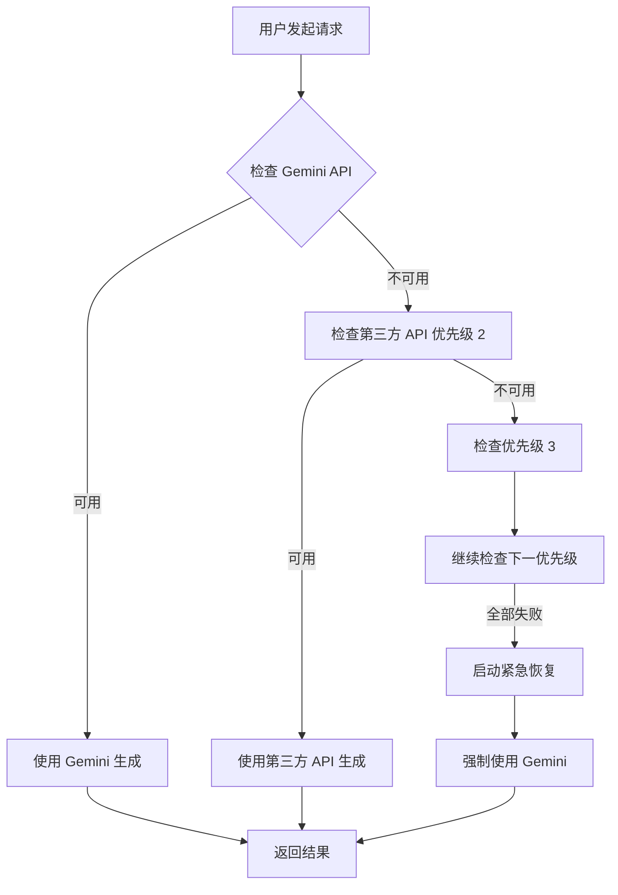

# 🎨 AI 黑板画生成器

一个基于 Cloudflare Edge Computing 的 AI 图片生成服务，专注于生成黑板粉笔画风格的艺术作品。支持多种 AI 模型智能兜底，确保服务高可用性。

## ✨ 核心特性

### 🖼️ 智能图片生成
- **黑板粉笔画风格**: 专注生成教室黑板粉笔画效果
- **多风格扩展**: 支持云彩、课本铅笔画等多种艺术风格  
- **智能提示词优化**: AI 自动优化提示词以达到最佳视觉效果
- **实时生成**: 秒级响应，用户体验流畅

### 🤖 多层 API 智能兜底
- **主服务**: Google Gemini API（环境变量配置）
- **第三方支持**: Grok API、OpenAI 兼容接口
- **智能故障转移**: 自动切换健康 API，服务不中断
- **优先级管理**: 灵活的 API 权重和优先级配置
- **实时监控**: 完整的 API 状态监控和诊断

### 🔧 强大的管理后台
- **安全认证**: 基于 Token 的安全管理系统
- **API 配置管理**: 一键添加、测试、管理多个第三方 API
- **提示词模板**: 自定义和编辑多种风格提示词
- **图片库管理**: 作品展示和管理
- **实时状态**: API 健康状态和性能监控面板

### 🛡️ 企业级可靠性
- **三层保护机制**: 智能兜底 → 紧急恢复 → 详细错误报告
- **自动恢复**: 失败 API 30 分钟后自动重新启用
- **错误隔离**: 单个 API 故障不影响整体服务
- **完整日志**: 全链路调用追踪和性能分析

## 🚀 快速部署指南

### 前置要求
- Cloudflare 账号（免费即可）
- Google Cloud 账号（获取 Gemini API Key）
- Git 基础操作能力

### 第一步：获取 API 密钥

#### 1.1 Google Gemini API
```bash
# 访问 Google AI Studio
https://aistudio.google.com/app/apikey

# 创建新的 API密钥
# 复制密钥，格式如：AIzaSyBlahBlahBlah
```

### 第二步：部署到 Cloudflare Pages

#### 2.1 克隆项目
```bash
# 克隆仓库
git clone https://github.com/keenturbo/AI-Chalkboard-Art.git
cd AI-Chalkboard-Art

# 可选：修改为你自己的仓库名
echo "ai-chalkboard-art" > .project-name
```

#### 2.2 部署到 Cloudflare Pages
```bash
# 安装 Wrangler CLI
npm install -g wrangler

# 登录 Cloudflare
npx wrangler login

# 部署到 Pages
npx wrangler pages deploy public --project-name ai-chalkboard-art
```

#### 2.3 通过 Web 界面部署（推荐新手）
1. 登录 [Cloudflare Dashboard](https://dash.cloudflare.com/)
2. 选择 Pages → Create a project → Connect to Git
3. 授权 GitHub，选择 `AI-Chalkboard-Art` 仓库
4. 构建设置保持默认
5. 点击 Save and Deploy

### 第三步：配置环境变量

#### 3.1 访问项目设置
```
Cloudflare Dashboard → Pages → ai-chalkboard-art → Settings → Environment variables
```

#### 3.2 添加必需的环境变量
```
# 主 API 密钥（必需）
GEMINI_API_KEY=AIzaSyBlahBlahBlahYourGeminiKeyHere

# Cloudflare 存储配置（必需）
KV_AI_CHALKBOARD=your_kv_namespace_id_here
R2_BUCKET=your_r2_bucket_name_here

# 可选配置
AI_MODEL_URL=                            # 自定义 API 端点
```

#### 3.3 创建 KV 和 R2 资源
```
# 创建 KV 命名空间
Cloudflare Dashboard → Workers & Pages → KV → Create namespace
# 命名为：ai-chalkboard-config

# 创建 R2 存储桶
Cloudflare Dashboard → R2 → Create bucket  
# 命名为：ai-chalkboard-art-images
```

#### 3.4 绑定资源
```
Settings → Functions → KV namespace bindings
# 添加：Variable name: KV_AI_CHALKBOARD → 选择刚创建的 KV

Settings → R2 object storage
# 添加：Variable name: R2_BUCKET → 选择刚创建的 R2 bucket
```

### 第四步：访问和配置

#### 4.1 访问部署好的网站
```
# 主页面
https://ai-chalkboard-art.pages.dev

# 管理后台
https://ai-chalkboard-art.pages.dev/admin.html
```

#### 4.2 首次登录设置
- **默认账号**: `admin`
- **默认密码**: `admin`
- **重要**: 登录后立即修改密码！

## 📋 完整使用指南

### 用户界面使用

#### 基础图片生成
1. **输入角色名称**: 如"Hello Kitty"、"皮卡丘"、"小猫咪"
2. **选择风格**: 
   - 🏫 黑板粉笔画（默认）
   - ☁️ 现实主义云彩
   - ✏️ 课本铅笔画
   - 更多风格可后台添加
3. **点击生成**: AI 自动选择最佳 API 生成图片

#### 限制说明
- **免费额度**: 每日 3 次免费生成
- **重置时间**: 每日 0 点（UTC+8）自动重置
- **无限制部署**: 自己部署可移除所有限制

### 管理后台配置

#### 🔐 安全设置
- **修改密码**: 基础设置 → 更新管理凭证
- **Token 管理**: 自动生成安全令牌用于 API 调用
- **访问日志**: 查看管理操作历史

#### 🤖 API 配置管理

##### 添加第三方 API
1. 进入 "API 配置管理"
2. 点击 "添加新 API"
3. 填写配置信息：
   ```
   API名称: Grok
   提供商: grok
   基础URL: https://api.x.ai/v1
   API密钥: xai-your-key-here
   模型名称: grok-4.1-fast
   优先级: 2
   ```

##### API 测试和监控
- **连接测试**: 点击 "测试连接" 验证 API 配置
- **状态监控**: 实时查看 API 健康状态
- **优先级调整**: 数字越小优先级越高（1 最高）

##### 兜底策略配置
```
示例配置：
优先级1: Gemini (环境变量，主要服务)
优先级2: Grok API (第三方兜底)
优先级3: 其他第三方 API
紧急恢复: 强制使用 Gemini 环境变量
```

#### 📝 提示词管理

##### 黑板画提示词模板
```
请生成一张{角色名称}的黑板粉笔画，要求：
1. 黑色黑板背景，有粉笔质感
2. 角色形象可爱，线条简洁
3. 具有教室黑板画的艺术风格
4. 粉笔纹理明显，有轻微的粉笔灰效果
```

##### 风格扩展
- 支持多语言提示词
- 变量替换系统（{角色名称}）
- 完整模板编辑器
- 实时效果预览

#### 🖼️ 图片库管理
- **添加作品**: 上传优秀作品到画廊
- **轮播展示**: 前端自动轮播展示
- **批量管理**: 支持批量添加和删除

## 🔧 高级配置详解

### 多 API 兜底机制详解

#### 工作流程


#### 故障转移规则
1. **主 API 失败**: 立即切换到下一个优先级 API
2. **连续失败 3 次**: 自动禁用该 API 30 分钟
3. **全部失败**: 启动紧急恢复模式
4. **自动恢复**: 30 分钟后重新尝试禁用的 API

### 错误处理和诊断

#### 常见错误类型
- **401 认证失败**: API 密钥错误或过期
- **429 频率限制**: API 调用过于频繁
- **500 服务错误**: 服务商内部错误
- **网络超时**: 连接超时（默认 30 秒）

#### 调试工具
```bash
# 查看 Cloudflare Functions 日志
Cloudflare Dashboard → Pages → ai-chalkboard-art → Functions → Logs

# 浏览器控制台调试
F12 → Console → 查看实时调试信息

# API 状态查看
访问 /api/admin-config → 查看系统状态
```

### 环境变量详细说明

```bash
# === 必需配置 ===
GEMINI_API_KEY=AIzaSy...              # Google Gemini API 密钥
KV_AI_CHALKBOARD=kv_namespace_id      # KV 存储命名空间 ID
R2_BUCKET=bucket_name                 # R2 存储桶名称

# === 可选配置 ===
AI_MODEL_URL=https://api.example.com/v1  # 自定义 API 端点
ADMIN_KV_NAMESPACE=admin_kv_id         # 管理配置专用 KV（可选）
```

#### 配置验证命令
```bash
# 验证环境变量
curl -X GET "https://ai-chalkboard-art.pages.dev/api/admin-config"

# 测试 Gemini API
curl -X POST "https://generativelanguage.googleapis.com/v1beta/models/gemini-3-pro-image-preview:generateContent" \
  -H "Content-Type: application/json" \
  -H "x-goog-api-key: YOUR_GEMINI_KEY" \
  -d '{"contents":[{"parts":[{"text":"Test message"}]}]}'
```

## 🛠️ 技术架构详解

### 前端架构
```
public/
├── index.html          # 主用户界面
└── admin.html          # 管理后台界面

技术栈：
- HTML5 + CSS3 + Vanilla JavaScript
- Tailwind CSS (CDN)
- 响应式设计
- 图片轮播系统
- 实时状态更新
```

### 后端架构
```
functions/
├── types.ts                # TypeScript 类型定义
├── api/                    # API 端点
│   ├── generate.ts         # 标准图片生成 API
│   ├── generate-new.ts     # 智能兜底生成 API
│   ├── admin-config.ts     # 管理配置 API
│   ├── admin-api-config.ts # API 管理 API
│   └── admin-gallery.ts    # 图片库管理 API
└── lib/                    # 核心库文件
    ├── api-manager.ts      # 多 API 管理器
    ├── grok.ts             # Grok API 适配器
    ├── gemini.ts           # Gemini API 适配器
    ├── image-generator.ts  # 图片生成核心
    ├── prompts.ts          # 提示词管理
    └── key-manager.ts      # 密钥管理器
```

### 核心模块说明

#### APIManager (api-manager.ts)
**职责**: 多 API 统一管理和智能调度
```typescript
class APIManager {
  // 获取可用 API 列表（按优先级排序）
  async getAvailableAPIs(): Promise<APIProvider[]>
  
  // 智能生成（多层兜底）
  async generateImageWithFallback(prompt: string): Promise<GenerationResult>
  
  // 紧急恢复模式
  async emergencyRecovery(prompt: string): Promise<GenerationResult>
}
```

#### GrokAPI (grok.ts)
**职责**: Grok API 适配器，支持 OpenAI 兼容端点
```typescript
class GrokAPI {
  // 生成图片（通过 chat/completions）
  async generateImage(prompt: string): Promise<string>
  
  // 连接测试（支持 /models 和 /chat/completions）
  async testConnection(): Promise<TestResult>
}
```

#### KeyManager (key-manager.ts)
**职责**: API 密钥轮换和状态管理
```typescript
class KeyManager {
  // 获取下一个可用密钥
  getNextKey(): string
  
  // 更新密钥状态
  updateKeyStatus(key: string, status: string): Promise<void>
}
```

### 数据存储方案

#### KV 存储（配置数据）
```typescript
interface AdminConfig {
  gallery_images: string[];      // 图片库 URL 列表
  api_configs: ApiConfig[];      // API 配置列表
  prompts: PromptConfig[];       // 提示词模板
  admin_credentials: {           // 管理员凭证
    username: string;
    password: string;
  };
}
```

#### R2 存储（图片文件）
- **图片格式**: PNG、JPEG
- **命名规则**: `ai-chalkboard-{character}-{timestamp}.png`
- **公共访问**: 支持自定义域名绑定
- **自动清理**: 可配置保留期限

## 📊 监控和运维

### 实时状态面板
访问管理后台可查看：
- API 总数量和启用状态
- 各 API 错误计数统计
- 最近生成成功率
- 响应时间统计

### 性能监控指标
```typescript
interface Metrics {
  total_requests: number;        // 总请求数
  success_rate: number;          // 成功率
  avg_response_time: number;     // 平均响应时间
  api_health: {                  // API 健康状态
    [api_name]: {
      enabled: boolean;
      error_count: number;
      last_used: timestamp;
    }
  };
}
```

### 日志分析
```bash
# 查看应用日志
wrangler pages deploy tail --project-name ai-chalkboard-art

# 过滤错误日志
wrangler pages deploy tail --filter="ERROR" --project-name ai-chalkboard-art

# 实时监控
wrangler pages deploy tail --follow --project-name ai-chalkboard-art
```

## 🔒 安全性指南

### 认证系统
- **Token-Based 认证**: 基于 JWT 的安全令牌
- **密码加密**: 使用 BCrypt 加密存储
- **会话管理**: 自动过期和刷新机制

### 数据保护
- **API 密钥加密**: KV 存储前自动加密
- **敏感数据脱敏**: 前端不显示完整密钥
- **访问日志**: 完整的操作审计记录

### 网络安全
```bash
# HTTPS 强制重定向
# Cloudflare 默认提供 SSL/TLS 加密

# CORS 配置
Access-Control-Allow-Origin: *
Access-Control-Allow-Methods: GET, POST, PUT, DELETE
Access-Control-Allow-Headers: Authorization, Content-Type

# 安全头配置
X-Content-Type-Options: nosniff
X-Frame-Options: DENY
X-XSS-Protection: 1; mode=block
```

## 🚀 故障排查手册

### 常见问题解决

#### Q1: 部署后页面显示空白？
**解决方案**:
```bash
# 1. 检查 Functions 部署状态
等待 1-2 分钟让 Cloudflare 完成部署

# 2. 清除浏览器缓存
Ctrl+Shift+R 强制刷新

# 3. 检查环境变量配置
确保 GEMINI_API_KEY、KV_AI_CHALKBOARD、R2_BUCKET 都已正确配置
```

#### Q2: API 测试连接失败？
**解决方案**:
```bash
# 1. 验证 API 密钥格式
确保密钥没有多余空格，完整复制

# 2. 检查网络连接
curl -I https://api.x.ai/v1/models

# 3. 查看详细错误信息
浏览器 F12 → Network → 查看失败请求的 Response
```

#### Q3: 生成失败提示 429 错误？
**解决方案**:
- 这是正常的频率限制
- 系统会自动切换到备用 API
- 建议添加更多第三方 API 作为兜底

#### Q4: 图片无法加载？
**解决方案**:
```bash
# 1. 检查 R2 存储配置
确保 R2_BUCKET 绑定正确

# 2. 验证图片 URL 有效性
curl -I "https://your-r2-domain.com/path/to/image.png"

# 3. 检查公共访问权限
R2 存储桶需要设置公共读取权限
```

### 调试工具使用

#### 浏览器开发者工具
```javascript
// 1. 查看 API 调用详情
F12 → Network → 查看 /api/generate 请求

// 2. 监控控制台日志
F12 → Console → 查看详细错误信息

// 3. 检查本地存储
Application → Local Storage → 查看使用计数
```

#### Cloudflare 日志
```bash
# 实时日志监控
wrangler pages deploy tail --project-name ai-chalkboard-art

# 导出日志进行分析
wrangler pages deploy tail --format=json > logs.json
```

## 📈 性能优化建议

### 前端优化
- **图片预加载**: 轮播图片预先缓存
- **懒加载**: 大图片按需加载
- **CDN 加速**: 利用 Cloudflare 全球网络

### 后端优化
- **API 连接池**: 复用 HTTP 连接
- **密钥轮换**: 负载均衡多个密钥
- **缓存策略**: KV 启用 TTL 缓存

### 成本优化
- **免费额度利用**: 充分使用 Cloudflare 免费计划
- **API 调用优化**: 减少无效请求
- **图片压缩**: R2 启用自动压缩

## 🗺️ 未来发展规划

### 短期目标（1-2 个月）
- [ ] 更多艺术风格支持（油画、水彩、像素风）
- [ ] 批量生成功能
- [ ] 用户生成历史记录
- [ ] 移动端适配优化

### 中期目标（3-6 个月）
- [ ] 更多第三方 API 支持（Claude、LLaVA）
- [ ] 本地模型集成
- [ ] 用户反馈和评分系统
- [ ] 高级参数调节

### 长期目标（6-12 个月）
- [ ] API 市场集成
- [ ] 多语言支持
- [ ] 企业级功能（团队协作、权限管理）
- [ ] 性能监控仪表板

### 技术演进
- [ ] WebAssembly 图像处理
- [ ] Edge AI 模型推理
- [ ] 实时协作功能
- [ ] 区块链版权保护

## 🤝 贡献指南

我们欢迎所有形式的贡献！

### 开发环境搭建

#### 1. 克隆和安装
```bash
# 克隆项目
git clone https://github.com/keenturbo/AI-Chalkboard-Art.git
cd AI-Chalkboard-Art

# 安装开发依赖
npm install

# 安装 Wrangler CLI
npm install -g wrangler
```

#### 2. 本地开发
```bash
# 启动本地开发服务器
npm run dev

# 或者使用 Wrangler
npx wrangler pages dev public

# 本地调试环境
访问 http://localhost:8787
```

#### 3. 环境变量配置
```bash
# 创建开发环境变量文件
echo "GEMINI_API_KEY=your_dev_key" > .dev.vars
echo "KV_AI_CHALKBOARD=dev_kv" >> .dev.vars
echo "R2_BUCKET=dev_bucket" >> .dev.vars
```

### 代码规范

#### TypeScript 配置
```json
{
  "compilerOptions": {
    "strict": true,
    "target": "ES2022",
    "module": "ESNext",
    "moduleResolution": "Node"
  }
}
```

#### 代码风格
- **缩进**: 2 个空格
- **引号**: 单引号优先
- **命名**: camelCase for variables, PascalCase for classes
- **注释**: JSDoc 格式

#### 提交规范
```bash
# 功能开发
git commit -m "feat: 添加新的艺术风格支持"

# 修复问题
git commit -m "fix: 修复 API 连接超时问题"

# 文档更新
git commit -m "docs: 更新部署说明"

# 代码优化
git commit -m "perf: 优化图片加载性能"
```

### Pull Request 流程
1. Fork 项目到个人仓库
2. 创建特性分支 (`git checkout -b feature/new-style`)
3. 提交更改 (`git commit -am 'Add new style support'`)
4. 推送分支 (`git push origin feature/new-style`)
5. 创建 Pull Request
6. 等待代码审查和合并

## 📄 许可证

本项目采用 MIT 许可证，详见 [LICENSE](LICENSE) 文件。

### 许可证要点
- ✅ 商业使用
- ✅ 修改和分发
- ✅ 私人使用
- ❌ 需要包含许可证和版权声明
- ❌ 不提供担保

## 🙏 致谢与鸣谢

### 技术合作伙伴
- **Google Generative AI**: 提供强大的图片生成能力
- **OpenAI API 标准**: 为第三方集成提供统一规范
- **Cloudflare**: 提供可靠的边缘计算基础设施

### 开源项目
- **Tailwind CSS**: 现代化的 CSS 框架
- **TypeScript**: 提供类型安全的开发体验
- **GitHub Actions**: 自动化部署和集成

### 社区贡献者
感谢所有为项目贡献代码、反馈建议的用户！

### 特别鸣谢
- 测试用户提供的宝贵反馈
- 开源社区的技术支持和灵感

---

## 📞 联系与支持

### 获取帮助
- **GitHub Issues**: [提交问题](https://github.com/keenturbo/AI-Chalkboard-Art/issues)
- **项目主页**: [GitHub Repository](https://github.com/keenturbo/AI-Chalkboard-Art)
- **实时演示**: [在线体验](https://ai-chalkboard-art.pages.dev)

### 商务合作
- 技术咨询和定制开发
- 企业级部署支持
- 联系邮箱: turbokeem@gmail.com

---

## 🎉 开始你的 AI 创作之旅！

1. **一键部署**: 按照上面的部署指南，5 分钟内拥有自己的 AI 画板
2. **开始创作**: 输入你喜欢的角色，让 AI 为你创作独特的黑板画作品
3. **自定义扩展**: 添加更多 API 和风格，打造专属的 AI 艺术平台

**享受创作的乐趣，探索 AI 艺术的无限可能！** 🚀

---

*最后更新: 2024-12-04 | 版本: v1.0.0 | 文档状态: 完整版*